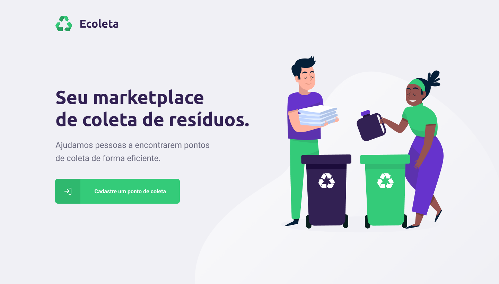
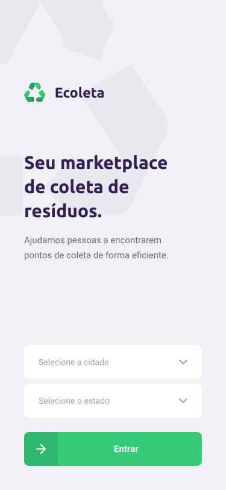
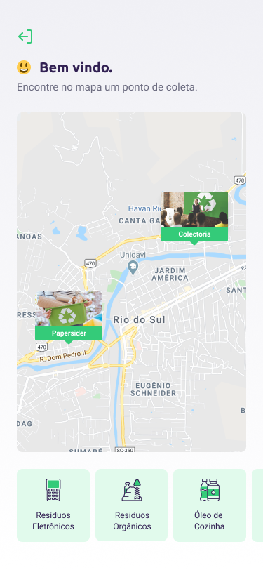

# ♻ Ecoleta


### ℹ Sobre
O Ecoleta, desenvolvido durante a semana do meio ambiente, é uma marketplace para pontos de coleta de resíduos recicláveis. O objetivo é facilitar a busca e entrega desses materiais, contribuindo com nosso platena!

Construída durante a Next Level Week, organizada pela Rocketseat, o evento possui o intuito de lhe levar para o próximo nível de sua carreira.

### 🛠 Tecnologias Utilizadas
- Node.js
- ReactJS
- React Native

### 🌐 Web
Interface Web, onde os pontos de coleta podem ser cadastrados.

 

### 📱 Mobile
Interface Mobile, onde os pontos podem ser visualizados no mapa, filtrados e detalhados.
<div align="left">
    
    
</div>

### 👨‍💻 Como utilizar
É necessário ter na sua máquina
- Node.js, e um gerenciador de pacotes (npm / yarn) para interpretar o código e instalação dedependências.
- Expo, para execução do mobile.

```sh
# Acessando o backend
$ cd server
# Para instalar todas as dependências, execute:
$ npm install
# Para criar o banco de dados da aplicação, execute:
$ npm run knex:migrate
# Para adicionar os dados pré-estabelecidos no banco, execute:
$ npm run knex:seed
# Para iniciar a aplicação, execute
$ npm run dev

#Acessando web
$ cd web
# Instalando depêndencias
$ npm install
# Iniciando web
$ npm start

# Acessando o mobile
$ cd mobile
# Instalando depêndencias
$ npm install
# Iniciando mobile
$ npm start
```

### 📄 Licença
Hospedado sob a licença MIT.
